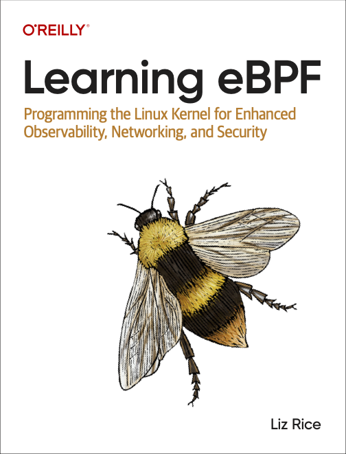

# Welcome to your CDK TypeScript project

This repo was created to create a ec2 instance with Ubuntu 22.04 amd (x86_64) compatible for the
book "Learning eBPF" , exercises from this GitHub repo
<https://github.com/david68cu/learning-ebpf>

Deployed in us-eas-1
570475827592

## Bootstrapping

Modify cdk.json to add

```json
   "@aws-cdk/core:bootstrapQualifier": "ebpf",
   "@aws-cdk/core:toolkitStackName": "ebpf-stack",
```

Then  export aws variables and bootstrap

```source scripts/exports.sh```
```source scripts/bootstrap.sh```
```cdk synth```
```cdk deploy```

The `cdk.json` file tells the CDK Toolkit how to execute your app.

## Useful commands

* `npm run build`   compile typescript to js
* `npm run watch`   watch for changes and compile
* `npm run test`    perform the jest unit tests
* `npx cdk deploy`  deploy this stack to your default AWS account/region
* `npx cdk diff`    compare deployed stack with current state
* `npx cdk synth`   emits the synthesized CloudFormation template
